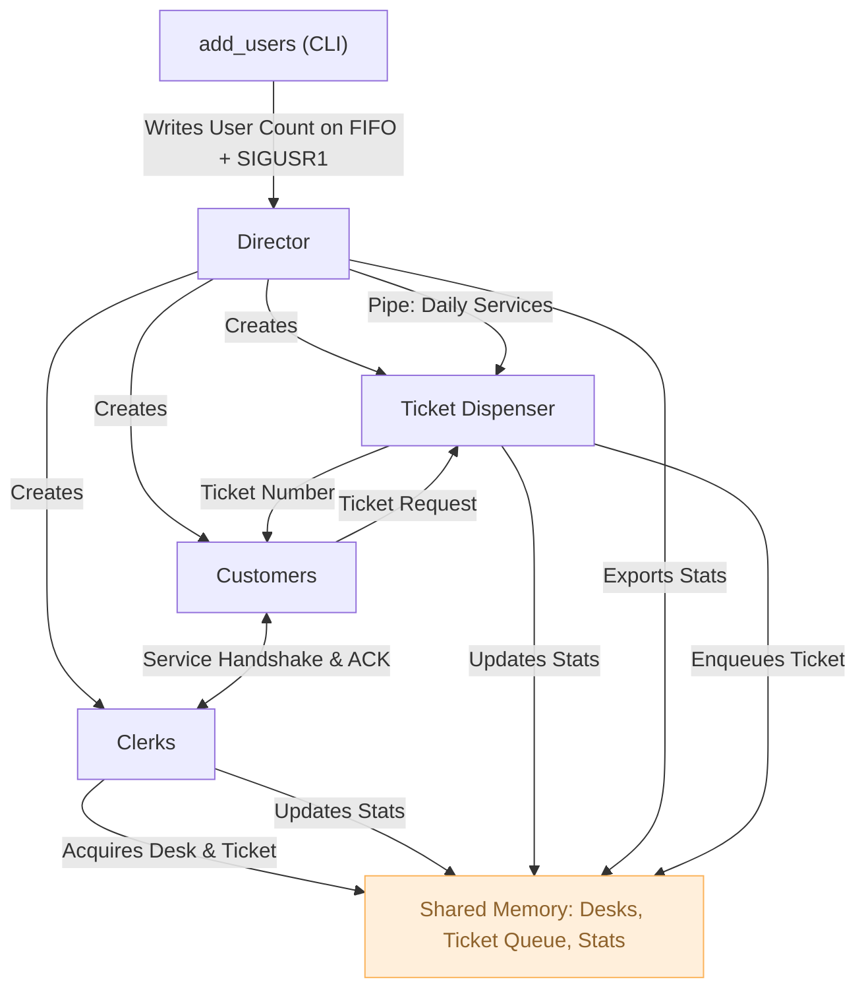

# Post Office Simulation: Advanced IPC & Concurrency in C

### Overview
A multiprocess C application that simulates a post office environment. The project focuses heavily on **POSIX Inter-Process Communication (IPC)** and **synchronization primitives** to manage highly concurrent interactions between customers, clerks, and a ticket dispenser, all orchestrated by a central director process.

### Team & Collaboration
This project was developed in a team of 3 students. To ensure a comprehensive understanding of the core concepts, we adopted a fully collaborative approach (avoiding strict task siloing). All team members were equally involved in the design, implementation, and debugging of the entire codebase.

**My hands-on experience in this project includes:**
* End-to-end implementation of multiprocess logic and synchronization mechanisms.
* Designing, testing, and troubleshooting IPC tools (Shared Memory, Message Queues, Semaphores).
* Handling custom memory management and pointer arithmetic for shared memory structs.
* Collaborative debugging and Makefile configuration.

**Co-authors:** Giaccherini Davide, Kukaj Briken

---

### Tech Stack & Concepts
* **Language:** C (POSIX standard)
* **Concurrency:** Multi-processing (`fork()`, `exec()`)
* **IPC Tools:** Shared Memory (`shmget`, `shmat`), Message Queues, Pipes, FIFOs, Signals.
* **Synchronization:** System V Semaphores (Mutexes, Counting Semaphores, Barriers).
* **Tools:** GCC, Makefile.

---

### Core Architecture & Processes

The simulation is entirely event-driven and synchronized across the following independent processes:

* **Director (`direttore`):** The master process. Handles the creation/termination of all child processes, manages error states, triggers daily simulation cycles, and dynamically injects new users upon request. It also computes and exports simulation statistics.
* **Ticket Dispenser (`erogatore_ticket`):** Receives the daily available services via Pipe from the Director. It listens for user requests, validates them, enqueues tickets in Shared Memory, and assigns ticket numbers.
* **Clerks (`operatori`):** Assigned a specific service type at launch. They compete for available desks at the start of the day. They actively pull tickets from the Shared Memory queue, establish a direct handshake with the User via Message Queues, simulate the service time, update stats, and manage their own pause states (`SIGSTOP`/`SIGCONT`).
* **Customers (`utente`):** Generates random service requests. Simulates travel time to the office, sequentially requests tickets, and waits in queue. If not served by the end of the day, they handle the timeout and leave.
* **Dynamic Injector (`add_users`):** A CLI utility that allows injecting new users into a running simulation in real-time using FIFOs and `SIGUSR1` signals.

---

### IPC & Memory Management Breakdown

This project implements a complex web of IPC mechanisms to ensure thread-safe operations without deadlocks or race conditions:

#### 1. Shared Memory (Custom Pointer Management)
Used as the central data hub, accessible by the Director, Dispenser, and Clerks. It stores:
* The state of all service desks.
* A **Circular Queue** of active tickets.
* Global and service-specific statistics.
* *Technical Highlight:* Implemented custom **memory offsets** to allow distinct processes to safely calculate coherent pointers when accessing dynamically sized arrays and structs within the shared memory segment.

#### 2. Message Queues
Used for direct, asynchronous communication:
* **User <-> Dispenser:** For ticket requests and availability responses/errors.
* **Clerk <-> User:** For the service handshake (Clerk calls -> User ACKs -> Clerk finishes -> User leaves).

#### 3. Semaphores (Synchronization)
* **Mutexes:** 3 distinct semaphores to lock critical sections (Desk List, Ticket Queue, Statistics).
* **Resource Counters:** 2 semaphores per service to track queued tickets and available desks.
* **Barriers:** A set of 4 semaphores used to synchronize the start of the day (ensuring all Clerks and Users are ready) and to safely halt processes during the statistics printout phase.

#### 4. Signals (Asynchronous Events)
Custom signal handlers (`sigaction`) were implemented to manage the simulation flow:
* `SIGUSR1`: Triggers dynamic user injection / Normal simulation shutdown.
* `SIGUSR2`: Signals the end of the current day / Triggers emergency abort on child errors.
* `SIGTERM`: Fatal error handling.
* `SIGSTOP / SIGCONT`: Used to suspend and resume Clerks during their scheduled breaks.

#### 5. Pipes & FIFOs
* **Pipe:** Unidirectional daily communication of available services (Director -> Dispenser).
* **FIFO (Named Pipe):** Allows external terminal commands (`add_users`) to communicate with the running Director process.

---

### System Flow Diagram



### How to Build and Run

1. Clone the repository and navigate to the root folder:
```bash
cd lab-so-2024-2025
```

2. Compile the project using the provided Makefile:
```bash
make all
```

3. *(Optional)* Adjust simulation parameters in the `.conf` files located in the `conf/` directory.

4. Start the simulation:
```bash
bin/Direttore
```

5. To dynamically add users during runtime, open a new terminal and run:
```bash
bin/add_users <number_of_users>
```

6. Upon completion, simulation metrics will be exported to `Stats.csv`.